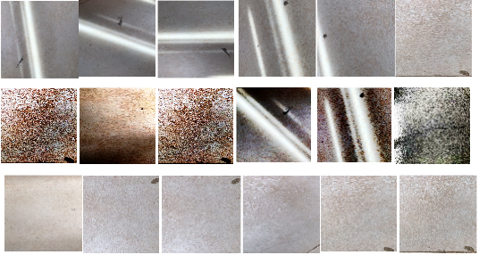

# Tile Surface Segmentation Using Deep Convolutional Encoder-Decoder Architecture
***
Visual inspection systems in industries have increasingly gained a lot of interests. 
Advances in manufacturing activities have led to mass production in order to reduce overall operational cost. 
The visual inspection systems provide instant quantitative feedback such as quantity and type of defects. 
In this section, we present a visual inspection method of tiles industry using a deep learning approach. 
The deep learning approach is employed for segmenting cracks and backgrounds in tiles. 
Due to the small size of the cracks, image segmentation is crucial. 
Architecture for segmenting semantic objects in a color image is the main inspiration to be applied on this paper. 
Semantic segmentation is widely applied for image analysis in the real world, one  of  which is to conduct 
a visual inspection of tile surfaces where each pixel input of high-resolution images is categorized into 
a set of semantic labels. In order to test the performance of the segmentation algorithm, 
SegNet  architecture  with the DeepLabV3plus were compared. A new dataset named UBIN 
is also proposed as a training and evaluation data. The training data that we have collected 
shows promising results on visual inspection when using the proposed algorithm. 
We believe that this work could improve to a more advanced manufacturing industries.

**Figure 1.** Input RGB Image from UBIN dataset and Output Ground Truth based on  Class  label.  The  Background  class  is  segmented  using  blue  color,  while the crack class is segmented using brown color

## Using MATLAB for Semantic Segmentation

[Image Processing and Computer Vision Semantic Segmentation](https://www.mathworks.com/solutions/image-video-processing/semantic-segmentation.html)

In MATLAB, the workflow for performing semantic segmentation follows these five steps:

1. Label data or obtain labeled data.
2. Create a datastore for original images and labeled images.
3. Partition the datastores.
4. Import a CNN and modify it to be a SegNet.
5. Train and evaluate the network.

### STEP 1: Label data or obtain labeled data.
Deep learning models are built on lots of data, and semantic segmentation is no exception. 
One option is to find labeled data on the Internet. If you have your own dataset, you can use the Image Labeler app in MATLAB. 
You can use this dataset to train a SegNet.

**Figure 2.** MATLAB Image Labeler app to label images for semantic segmentation.

### STEP 2: Create a datastore for original images and labeled images.
When working with lots of data, it is often not possible to load all the information into memory. 
To manage large datasets, you can use a datastore. 
A datastore contains the location of the files you want to access, and it lets you read them into memory only when you need to operate on the files.

To create a SegNet, you need two datastores:

1. ImageDatastore, which contains the original images
2. PixelLabelDatastore, which contains the labeled images

**Figure 3.** UBIN Dataset that exist in ImageDatastore

**Figure 4.** Images with labels built in ImageLabeller App

### STEP 3: Partition the datastores.
When creating a SegNet, you have to partition the datastore into two parts:

1. The training set, used to train the SegNet
2. The test set, used to evaluate the accuracy of a network

### STEP 4: Import a CNN and modify it to be a SegNet or Deeplabv3plus.
Loading a pretrained network, such as VGG16, and using the SegNetLayers command, creates the encoder-decoder architecture necessary for pixel-level labeling.

### STEP 5: Train and evaluate the network.
In the final step, you set hyperparameters for the network and train the network.

